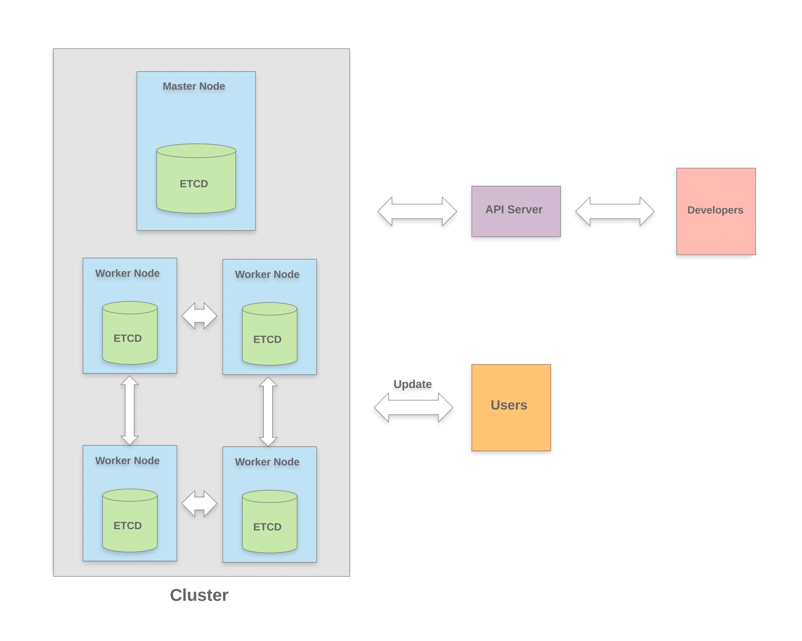

# Networking-inside-of-Kubernetes
## 1. Vision and Goals Of The Project
Etcd is a distributed database that stores concurrent cluster metadata such as node information inside of Kubernetes, and Etcd currently uses the Raft consensus algorithm which first updates go to a leader, then distributes updates to at least a majority of other Etcd cluster members before replying to the client.      
Disadvantage of current Raft algorithm is obvious that not able to scale which causes the speed to reply to the client is slow.     
Therefore, high level  goal of our projects is  replacing current Raft algorithm with a bandwidth-efficient and faster “gossip protocol” which will include:    
+ Providing a faster and stable algorithm that reply to the client in a shorter time. We can assume consistency right after a node updated its neighbor.     
+ Use “gossip protocol” that sync to neighbouring nodes directly (set up “practical set reconciliation”) instead of updating to leader node first     
+ Enabling an eventually consistent service with minimal cost performance for large scale clusters     

## 2. Users/Personas Of The Project
The modified version of Etcd targets Kubernetes developers and large clusters (much more than the [current usable limit of 1000][1] nodes in magnitude) that depend on Etcd for handling metadata and coordination. The gossip protocol accommodates hardware and design limitations (e.g. [hard disk speed][2], restricted cache availability) by reducing instruction redundancy.     

This project does NOT target:    
+ End-users of Kubernetes    
+ Applications that cannot tolerate eventual consistency, stale data, or rollbacks    
+ [Storage for more than a few gigabytes][3] (>8 GB) of data (use NewSQL instead)
+ [Horizontally scaling databases][4] (>1 cluster)

[1]: https://github.com/kubernetes/kubernetes/issues/20540
[2]: https://openai.com/blog/scaling-kubernetes-to-2500-nodes/
[3]: https://github.com/etcd-io/etcd/blob/master/Documentation/dev-guide/limit.md
[4]: https://github.com/etcd-io/etcd/blob/master/Documentation/learning/why.md

## 3. Scope and Features Of The Project
The scope of the project aims at large scale metadata stored in Etcd which need to be updated in time. Instead of Raft consensus algorithm, gossip protocol discards the “leader approach” and saves the cost of time to leader election and. Having one leader create a one point of failure not to mention that the leader has to communicate with all nodes for an update. Failure detection guarantee the reliability of the network from periodically pinging each node by its neighbors, which mitigates the  average error rate during the process of handshake.

Therefore, the main features are:
- Handling updates across global metadata in higher speed by gossip protocol
- Responding to client requests quicker 
- Failure detection ensures the robustness and reliability of the network

## 4. Solution Concept:
A high-level outline of the solution:     
Global Architectural Structure of the Project:      

This diagram illustrates our global architectural design for the project. The Cluster is depicted as being updated with new information from the user. Each worker node is then shown communicating and updating its neighboring nodes. This information then propagates throughout the entire cluster, thus completing reconciliation using a “gossip protocol”. 

    

This gif illustrates the "gossip protocol" we are trying to implement. The idea is to have a node receive some sort of update, and having it communicate with its neighboring nodes. This process then repeats itself until the update propagates throughout the cluster and a consensus is achieved.

Design Implications and Discussion:      
This practical set reconciliation algorithm will be replacing the Raft consensus algorithm. Raft makes use of a master node which distributes updates to its cluster of nodes. While this algorithm is fairly consistent, it fails to remain efficient as the number of nodes scales up, e.g. large scale clusters with over 5000+ nodes. As a result, our gossip protocol based algorithm will solve the issue of inefficiency with large scale environments, at the cost of consistency.       

## 5. Acceptance criteria
Minimum acceptance criteria is that compared with current Raft algorithm, creating a faster and stable algorithm with “gossip protocol”. Stretch goals are:    
+ Deploying our enhanced Etcd into a Kubernetes cluster and gather performance data comparing with a vanilla kubernetes cluster of different sizes    
+ Running our enhanced Etcd stablly in developer and user environment     
+ Shortening the time to respond to client request    
+ Detecting failures during networking     

## 6. Release Planning

- **First Step** (1~2 weeks)
  - Team members should have the basics of Golang and Gossip Protocol. 
  - Everyone should also get familiar with etcd's source code and architecture.
  - Meantime, discuss about how consensus protocol(Raft) works in etcd and what information should be synchronized between instances to perform updates.
- **Release 1** (1~2 weeks)
  - A simple implementation of reconciling information between two instances of etcd. 
  - CPIsync library, more specifically the interactive CPIsync, should be used to achieve this.
- **Release 2** (4~6 weeks)
  - Codes related to updating the key value store and logs (code piece such as electing leader, heatbeating) in etcd should be swapped out.
  - Implement gossip protocol to synchronize data between nodes.
  - Test cases are also expected to come together.
- **Release 3** (1 week)
  - Debug done, the new system should work.
- **Final Step** (Hopefully) (Class ends)
  - Use the stable released version to replace the metadata storage in Kubernetes.

## 7. Risks   
Potential risks for our project:   
+ Our enhanced Etcd could not be integrated in Kubernetes successfully   
+ Our enhanced Etcd is not stable or scalable in the environment   
+ Our algorithm may not be able to have enough consistency to offer a legitimate alternative to the Raft algorithm

## General comments
Before implementing “gossip protocol” into Etcd, the first step is to get practical set reconciliation between two instances, then test its performances in small groups in comparison to Raft. The result might be little in differences when group size is small, then we record the performance as an enlarging set.   
